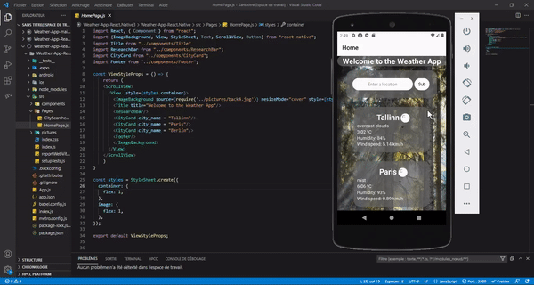

# Weather-App

First Web / mobile development projet for "end-user computing" course from Tallinn University.

There is two different pages :  
 - The first one is the home page where the user can see general information about a 3 capitals (Tallinn, Paris, Berlin). The user can also search for the weather around a specific city.  
 - The user lands on the second one after typing the name of a city and get all the informations about it.  

The data are issued from OpenWeatherAPI.  

## Demo

JavaScript Version

  

React Native Version

